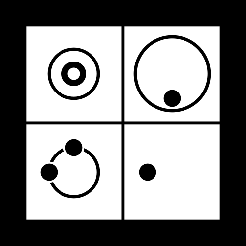

some important ideas for me:
- [Information wants to be free](https://en.wikipedia.org/wiki/Information_wants_to_be_free)
- [a cypherpunk's manifesto by Eric Hughes](https://www.activism.net/cypherpunk/manifesto.html)
- [Remember Aaron Awartz](http://www.rememberaaronsw.com/about) / [Guerilla Open Access Manifesto](https://archive.org/details/GuerillaOpenAccessManifesto/)
- FREE ASSANGE
- In solidarity with Library Genesis and Sci-Hub: [custodians.online](https://custodians.online/)
- [Description of NSA's sabotage](https://blog.cr.yp.to/20220805-nsa.html) of public cryptographic standards by Daniel J. Bernstein

software development philosophy:
- [Local-first software](https://www.inkandswitch.com/local-first/) by Martin Kleppmann
- [Free Alex Pertsev](https://www.freealex.nl/) / Source Code is Free Speech

_"It seemed so obvious to me: 'Here we are faced with the problems of loss of privacy, creeping computerization, massive databases, more centralization - and Chaum offers a completely different direction to go in, one which puts power into the hands of individuals rather than governments and corporations. The computer can be used as a tool to liberate and protect people, rather than to control them.'"_ 

-- Hal Finney

  

some pictures:

Hildegard von Bingen receiving a vision (1151)

  

my urbit planet

  

